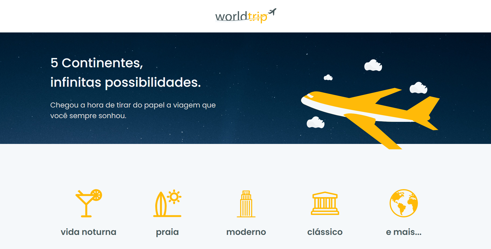
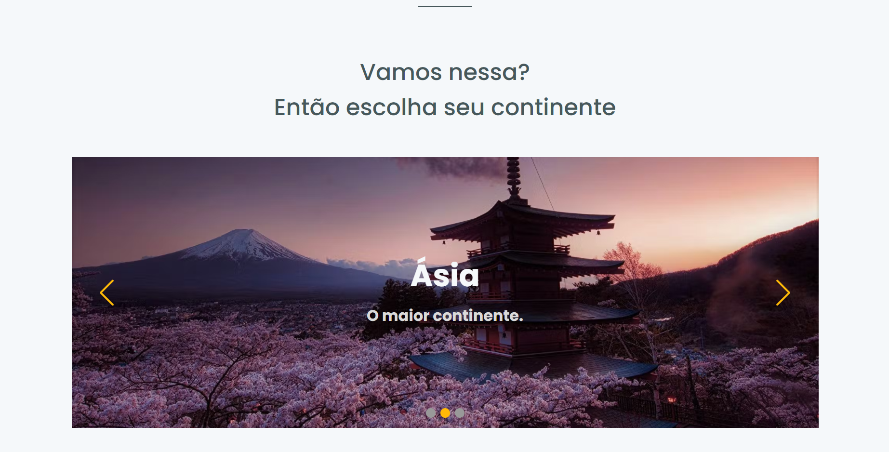
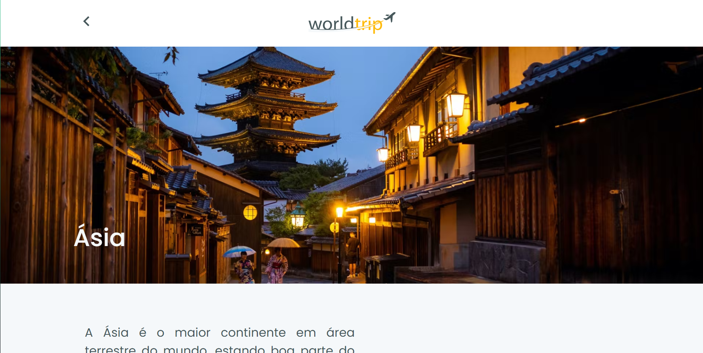
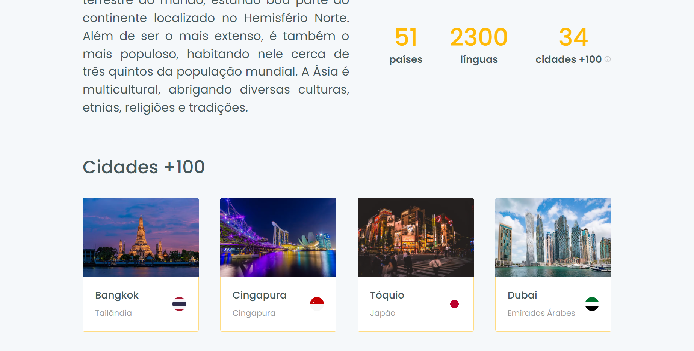

<p align="center">
   
</p>

<div align="center">
 <a href="#projeto">Projeto</a> •
 <a href="#tecnologias">Tecnologias Utilizadas</a> •
 <a href="#execucao">Como Executar</a> •
 <a href="#construcao">Em Construção</a> •
 <a href="#licenca">Licença</a> •
 <a href="#autor">Autor</a> •
 <a href="#contato">Contato</a>
</div>

---

# :fire: Obrigado por visualizar este repositório 

<p align="justify"> Olá, primeiramente me chamo Gabriel Kenji Poli Ozaki, tenho 21 anos e trabalho na área de Desenvolvedor Front-end. </p>

<p align="justify"> Para mais informações sobre mim, acesse o README em meu perfil do GITHUB.</p>

## :computer: <strong id="projeto">Sobre o Projeto </strong>

</img>
</img>
</img>
</img>

<p align="justify">O <strong>Worldtrip</strong> é uma aplicação voltada ao <strong>Blog Turístico</strong> exibindo o que cada continente tem a oferecer, assim como as cidades mais famosas, total de países e as linguagens.</p>

<p align="justify">Essa aplicação SpaceTraveling foi desenvolvida, através de um desafio feito pelo Bootcamp Ignite na trilha de ReactJS.</p>

### :pushpin: Funcionalidades

- [x] Slider de cada continente acessível
- [x] Exibir o conteúdo de cada continente
  - [x] Descrição
  - [x] Quantidade de países, línguas e cidades
  - [x] Listagem das cidades mais famosas e seus países correspondentes

### :triangular_ruler: Layout

<p>Você pode visualizar o layout do projeto através desse <a href="https://www.figma.com/file/PrsADfNTt9PxZWojAnAv1D/Desafio-1-M%C3%B3dulo-4-ReactJS-(Copy)?node-id=0%3A1">link</a>. É necessário ter conta no <a href="https://www.figma.com/">Figma</a> para acessá-lo.</p>

## :rocket: <Strong id="tecnologias"> Tecnologias Utilizadas </Strong>

[](https://nextjs.org/) [](https://www.typescriptlang.org/) [](https://sass-lang.com/) [](https://chakra-ui.com) [](https://prismic.io/) [](https://swiperjs.com/react)

## :runner: <strong id="execucao"> Como executar o projeto </strong>

[](https://classic.yarnpkg.com/en/docs/install/#windows-stable)

```bash
# Faça o clone deste repositório:
>> git clone https://github.com/WD-GabrielKenji/IgniteReactJs-Worldtrip.git
>> cd IgniteReactJs-Worldtrip >> code .
```
```bash
# Para executar a aplicação é necessário:

# Instalar as dependências: 
>> yarn
# Iniciar o servidor de desenvolvimento:
>> yarn dev
```
```bash
# Para inserir os dados da aplicação:

## Configurar o Prismic:
>> Seguir: https://imgur.com/gallery/TCQ2c0h (PRISMIC_API_ENDPOINT)
>> Seguir: https://imgur.com/gallery/2QLzmUn (PRISMIC_ACCESS_TOKEN)
## Definir a variável de ambiente do Prismic:
>> Criar o arquivo: .env.local
   >> PRISMIC_API_ENDPOINT=#Adicione aqui o ENDPOINT
   >> PRISMIC_ACCESS_TOKEN=#Adicione aqui o Token

>> Reinicie o servidor de desenvolvimento após inserir a variável de ambiente!
```

<pre>Agora basta acessar <a href="http://localhost:3000" rel="nofollow"><code>localhost:3000</code></a> em seu Browser, e usufruir da aplicação.</pre>

## :construction: <strong id="construcao"> Em construção </strong>

Funcionalidades que ainda estão sendo preparadas para serem incrementadas:

<ul>
  <li> Tema Dark </li>
  <li> Customizar scrollbar </li>
  <li> Adicionar aba de comentários </li>
</ul>

## :closed_book: <strong id="licenca"> Licença </strong>


Esse projeto está sob a licença MIT. Veja o arquivo [LICENSE](LICENSE) para mais detalhes.

## :boy: <strong id="autor"> Autor </strong>

<a href="https://github.com/WD-GabrielKenji">
 
 <br />
 <sub><b>Gabriel Kenji Poli Ozaki</b></sub></a> <a href="https://github.com/WD-GabrielKenji" title="Perfil Github"> :star2: 
</a>


Feito de ❤️ por Gabriel Kenji Poli Ozaki - Desenvolvedor Front-end 👋🏽

### :mailbox_with_mail: <strong id="contato"> Redes Sociais para Contato: </strong>

<p> Entre em contato, através destas redes sociais: </p>

[](https://www.linkedin.com/in/wdkenji/)  [](https://www.instagram.com/biel.kenjii/)  [](mailto:g.kenjijss@gmail.com)

[](https://github.com/WD-GabrielKenji)
